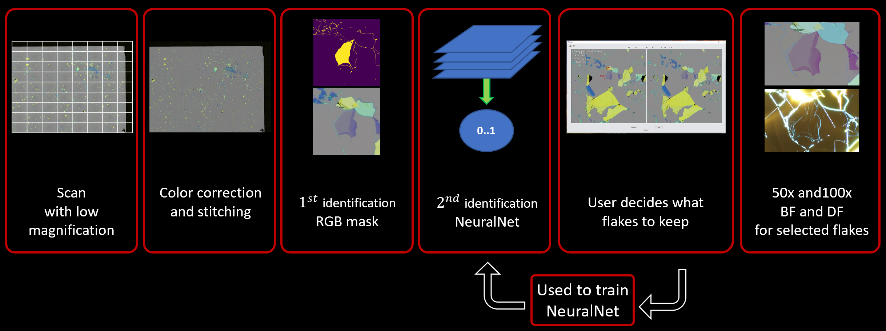
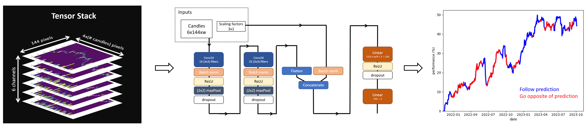
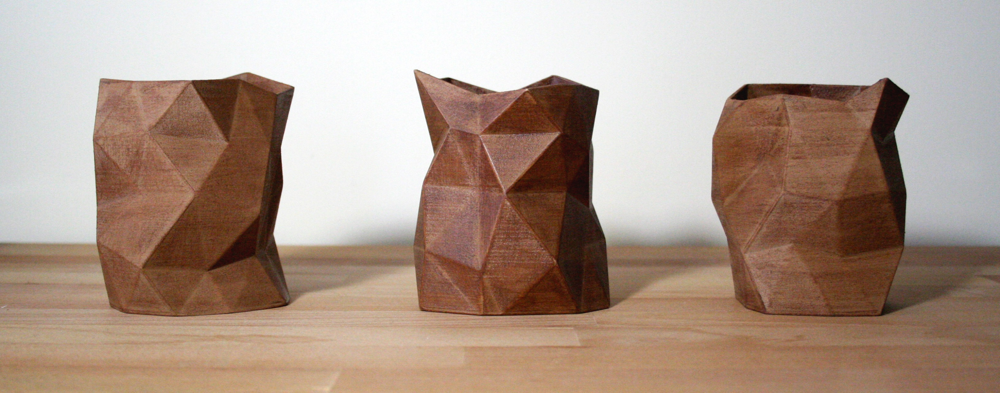

# Hi there 👋, I'm Clement

- I'm currently working at MIT as a Postdoc in the group of [Pablo Jarillo-Herrero](http://jarilloherrero.mit.edu/)
- I created an automated wafer imaging software ([Flinder](https://github.com/ClementCollignon/Flinder)) that find and characterize 2D materials

## If you Want to Learn More About my Research
  - Access my papers on [my Google Scholar](https://scholar.google.com/citations?user=rIwabBwAAAAJ&hl=en&oi=ao)
  - Connect with me on [LinkedIn](https://www.linkedin.com/in/clement-collignon/)

## Tools and Languages I Use:
 - Python, Numpy, SciPy, Matplotlib, Pandas
 - Pytorch, TensorFlow, OpenCV
 - PyQt, Tkinter
 - VSCode, Spyder, Jupyter
 - Latex

## See Below Four of my Projects:

### [Flinder](https://github.com/ClementCollignon/Flinder) and [Flinder2](https://github.com/ClementCollignon/Flinder2)

### [Technical Analysis by a Convolutional Neural Network](https://github.com/ClementCollignon/MarketNeutral_CNN)

### [A Random Vase Generator for your 3D Printer](https://github.com/ClementCollignon/Erratic-Vases)

